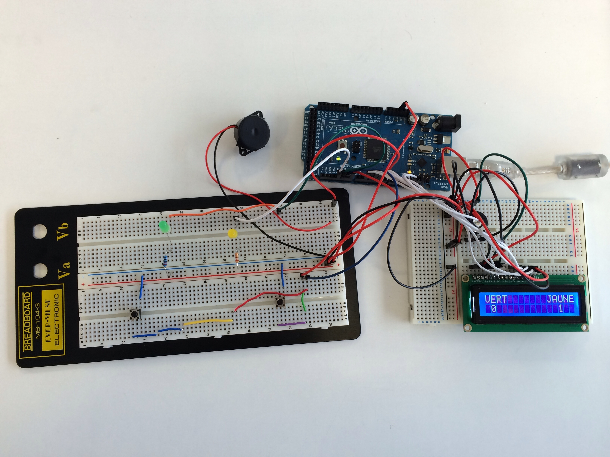

# Speedtouch Arduino

### Démonstration

### Matériel

* 1 carte ARDUINO MEGA
* 2 boutons poussoir
* 2 leds (1 verte & 1 jaune de préférence)
* 1 buzzer
* 1 afficheur LCD
* 1 potentiomètre (pour gérer les contrastes du LCD)